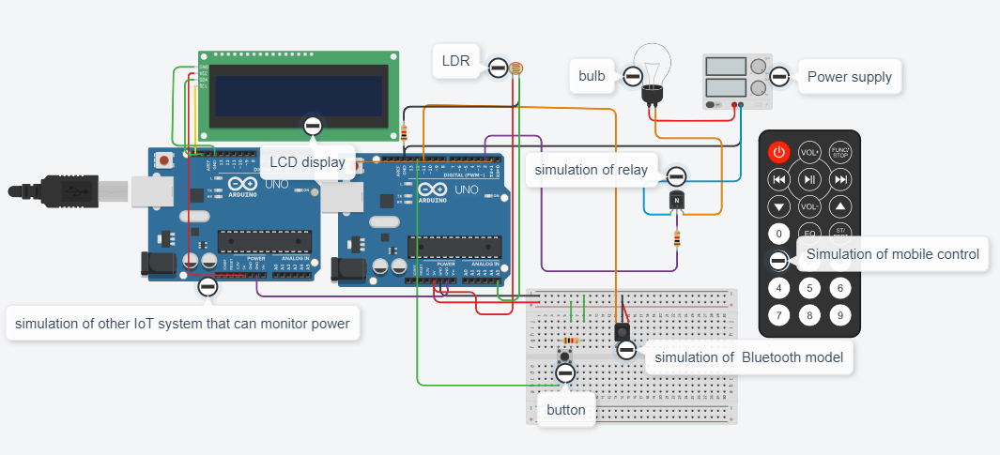

# Smart-lighting

This repository contains the research paper and supporting materials for the Smart Lighting project.

-----------------------------------------------------
## Overrview
The Smart Lighting project aims to create an intelligent lighting system using Arduino microcontrollers and various sensors. The system is designed to monitor and control lighting conditions based on environmental inputs and user interactions.

## Content:
1. Source Code
   - this contains the source code for the ransmitor aurdino and reciever aurdino
        a. Transmitor Code:
        b. Reciever code:
 

## Circuit diagram:
> this circuit diagram is made via the use of tinkerCAD  
 

### Components Used:
- Arduino Uno: Two microcontrollers used for controlling the system.
- LCD Display: Displays system status and information.
- LDR (Light Dependent Resistor): Senses ambient light levels.
- Bulb: Represents the lighting controlled by the system.Power Supply: Provides power to the circuit.
- Relay: Used for switching the bulb on and off.
- Button: Allows manual control of the system.
- Bluetooth Module: Enables wireless communication and control.
- Remote Control: Provides remote operation capability.
- IoT System Simulation: Demonstrates integration with other IoT systems for power monitoring.
